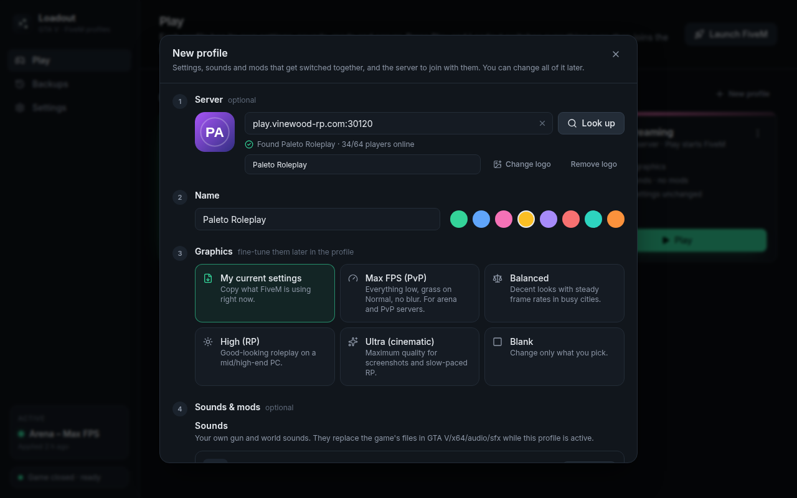
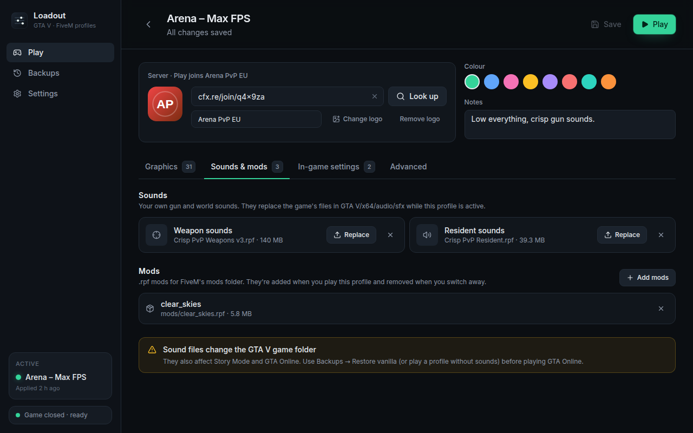

# Loadout

**One-click profile switcher for GTA V and FiveM.** Keep an "Arena – Max FPS" profile with your
own gun sounds that joins your PvP server, and a "City RP – Ultra" profile with your RP server's
mods. Press Play and Loadout switches everything over, then joins the server. No more editing
`settings.xml` by hand or dragging `.rpf` files around.


## What it does

- **Profiles**: graphics and display settings, GTA's in-game settings (FOV, brightness, HUD,
  volumes…), your own sounds and mods, and the server to join, all switched together.
- **Server and logo**: enter the server's `IP:port` or `cfx.re/join` code. Loadout looks up its
  name and logo and shows them on the profile. **Play** applies the profile, then joins the
  server through FiveM's own `fivem://connect/…` link.
- **Your own sounds and mods**: upload a `WEAPONS_PLAYER.rpf` and a `RESIDENT.rpf` (they replace
  the game's in `GTA V\x64\audio\sfx`) and any `.rpf` mods for FiveM's `mods` folder, per
  profile. Loadout keeps a copy, so only the profile you're playing has its files installed.
- **Safe by design**:
  - Every file Loadout replaces is backed up first.
  - Applying is a transaction: if anything fails, or the app crashes halfway, everything is
    put back.
  - **Restore vanilla** removes every sound and mod file and restores the originals.
  - Settings backups are taken before every apply. The first-run backup is kept forever.
- **Notices changes**: if you tweak settings in-game, Loadout offers to save them into the
  profile. If a FiveM update overwrote one of your files, it offers to re-apply.
- **Won't touch a running game**: FiveM reads its settings at start-up and rewrites them on exit,
  so Loadout waits for the game to close, or closes it for you if you ask.

| Create a profile                                   | Sounds & mods                                          |
| -------------------------------------------------- | ------------------------------------------------------ |
|    |  |
| **Edit graphics**                                  | **Preview before applying**                            |
|  |    |

## Install

Download Loadout from the **[latest release](../../releases/latest)**:

- **`Loadout_x.y.z_x64-setup.exe`**: the installer (recommended). It installs per-user, with no
  admin rights needed.
- **`Loadout_x.y.z_x64-portable.exe`**: a single exe with nothing to install.

Then:

- Windows will probably show a **SmartScreen** warning because the app isn't code-signed. Click
  _More info → Run anyway_.
- Loadout needs Microsoft Edge WebView2, which Windows 10/11 already have. If it's missing, the
  installer downloads it. The portable exe needs it to be there already.
- **GTA V installed under `Program Files`?** Windows only lets administrators change files
  there. Sound files that replace game audio need _Run as administrator_ in that case.
  Everything else works without it.

## How to use it

1. **First run**: Loadout finds your folders (`FiveM.app`, `%APPDATA%\CitizenFX`, the GTA V folder,
   `Documents\Rockstar Games\GTA V`) and backs up your current settings. Create a profile from
   your current settings, or start from the _Max FPS_ / _Ultra_ presets.
2. **New profile**:
   - _Server_ (optional): paste the server's `IP:port` or `cfx.re/join/…` code and press
     **Look up**. The name and logo fill in by themselves. If the server is offline, you can
     still save it and pick a logo yourself.
   - _Name_ and colour, then where the graphics start from: your current settings or a preset.
   - _Sounds & mods_ (optional): upload your `WEAPONS_PLAYER.rpf`, `RESIDENT.rpf` and any mods.
3. **Edit a profile** (click it):
   - _Server_: change the address, look it up again or change the logo.
   - _Graphics_: tick the settings this profile controls. Anything unticked is left alone.
   - _Sounds & mods_: upload, replace or remove files.
   - _In-game settings_: pick values from `fivem.cfg`.
   - _Advanced_: raw `settings.xml` keys.
4. **Play**: Loadout applies the profile, then FiveM joins its server. A profile without a
   server just starts FiveM. _Apply without playing_ is in the profile's ⋮ menu.

### Where things live

| What                                       | Path                                          |
| ------------------------------------------ | --------------------------------------------- |
| FiveM graphics & display                   | `%APPDATA%\CitizenFX\gta5_settings.xml`       |
| FiveM in-game settings (`profile_*` etc.)  | `%APPDATA%\CitizenFX\fivem.cfg`               |
| GTA V (Story/Online) graphics              | `Documents\Rockstar Games\GTA V\settings.xml` |
| Mods (`.rpf`)                              | `%LOCALAPPDATA%\FiveM\FiveM.app\mods`         |
| `WEAPONS_PLAYER.rpf`, `RESIDENT.rpf`       | `<GTA V folder>\x64\audio\sfx`                |
| Loadout's own data, uploads, backups, logs | `%LOCALAPPDATA%\Loadout`                      |

Loadout only rewrites the values a profile sets, and keeps every other byte of those files as it
was. Hardware-specific values such as your GPU name, adapter index and replay buffers are never
copied into a profile. That means profiles can be shared between PCs, and the game won't reset
its settings.

## Good to know

- **Pure Mode**: servers with `sv_pureLevel` set may refuse modified files. Use a profile
  without sounds or mods for those.
- **GTA Online**: sound files replace files in the GTA V folder, so they also affect Story Mode
  and GTA Online. Restore vanilla before playing Online.
- **Only `.rpf` files**: sounds are single `.rpf` files, and mods are `.rpf` files or a `.zip` of
  them. Executables, `.asi` loaders, ScriptHookV and `dinput8.dll` are refused. Loadout handles
  settings and cosmetic files only.
- **Server logos** come from the server itself (`/info.json`) or, for `cfx.re/join` codes, from
  the FiveM server list. Servers that hide their info or are offline can't be looked up; pick a
  logo by hand for those.
- **Coming from 0.1?** Saved servers move onto the profile they were linked to, and packs from
  the old pack library keep working in the profiles that used them. You can remove them in
  _Sounds & mods_.
- **FiveM for GTA V Enhanced** (early access since July 2026) isn't supported yet. Its file
  locations aren't confirmed, and Pure Mode is always on there anyway. The engine works from
  path detection and a value schema, so adding it later is a small change.
- A few setting values are marked **verify** in the editor (frame scaling and aspect ratio).
  Their numbers come from community references and haven't been checked in-game yet.

Loadout is not affiliated with Rockstar Games, Take-Two Interactive or Cfx.re.

## Testing on a real PC

This checklist covers what automated tests can't reach:

1. First run detects all four folders (or lets you browse to them).
2. Create **Arena** (Max FPS, your `WEAPONS_PLAYER.rpf`, your PvP server's `cfx.re/join` code)
   and **RP** (Ultra, a mod, your RP server's `IP:port`). Both should show the server's logo.
3. Play Arena. FiveM should join the server. In game, check that the graphics changed and the
   gun sounds are yours.
4. Close FiveM and play RP. Check that it joins the RP server, Ultra is on, the sounds are
   vanilla again and the mod is loaded.
5. **Backups → Restore vanilla**. The GTA V `x64\audio\sfx` files should be the originals
   (Steam/Rockstar "verify files" should find nothing to fix).
6. Look up a server that's offline: the error should say so, and choosing a logo by hand works.
7. For the settings marked _verify_, set each option in-game and compare it with
   `gta5_settings.xml`.

## Development

Tauri 2 app: a Rust backend in two crates and a React + TypeScript frontend.

```
crates/loadout-core/   all file logic (no UI): settings.xml patcher, schema & presets, fivem.cfg,
                       sound/mod uploads, the apply engine (plan → journal → execute →
                       rollback), backups, path detection, server lookup. Fully tested against
                       fake game folders.
src-tauri/             the desktop shell: Tauri commands over loadout-core
src/                   React UI. src/bindings is generated from Rust (ts-rs);
                       src/mock is an in-memory backend for running the UI in a browser
```

Prerequisites: Rust (stable), Node 22, pnpm 10. On Linux, also the
[Tauri system packages](https://v2.tauri.app/start/prerequisites/).

```sh
pnpm install
pnpm tauri dev          # run the desktop app
pnpm dev                # UI only, in a browser, against the mock backend
cargo test -p loadout-core   # core tests (also regenerates src/bindings)
pnpm lint && pnpm typecheck && pnpm test
pnpm tauri build        # Windows installer (run on Windows)
pnpm build && pnpm screenshots   # re-render the screenshots (needs Chromium)
```

To try the real app off Windows, point it at a fake folder layout:
`LOADOUT_SYSTEM_ROOT=/path/with/Local,Roaming,Documents LOADOUT_DATA_DIR=/tmp/loadout pnpm tauri dev`.

The mock backend accepts `?setup=1` (first-run wizard), `?running=1` (FiveM running) and
`?drift=1` (in-game changes) in the URL.

CI checks formatting, clippy, lints and all tests. It also runs the core tests on Windows and
builds the installer as a downloadable artifact.

**Releasing:** bump the version in `src-tauri/tauri.conf.json`, `package.json` and `Cargo.toml`,
then push to the default branch. The Release workflow publishes `v<version>` with the installer
and the portable exe, as long as that version has no release yet. Pushing a matching `v*` tag, or
running the workflow from the Actions tab, also works.
