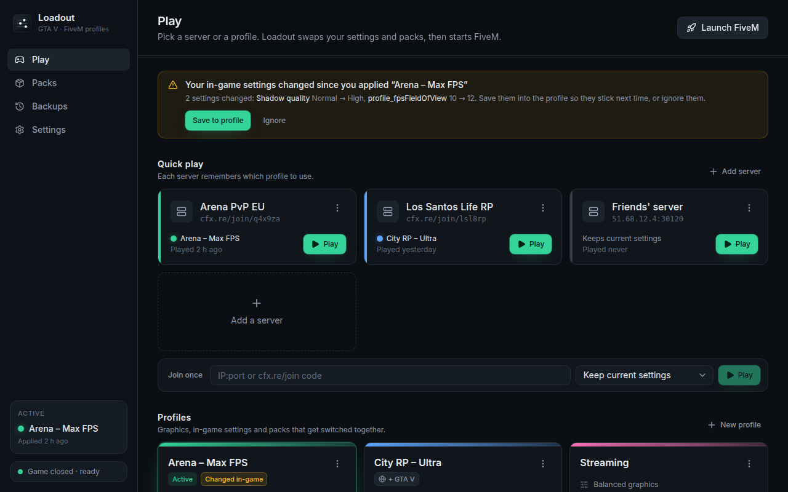
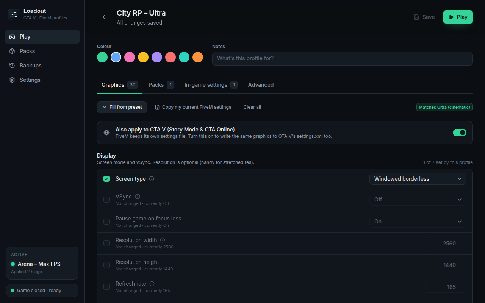
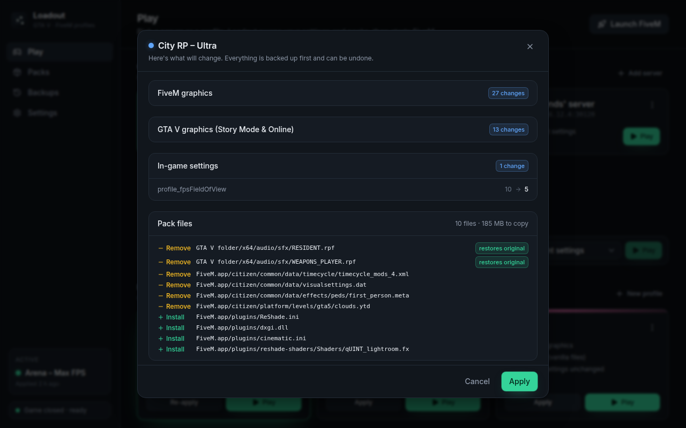
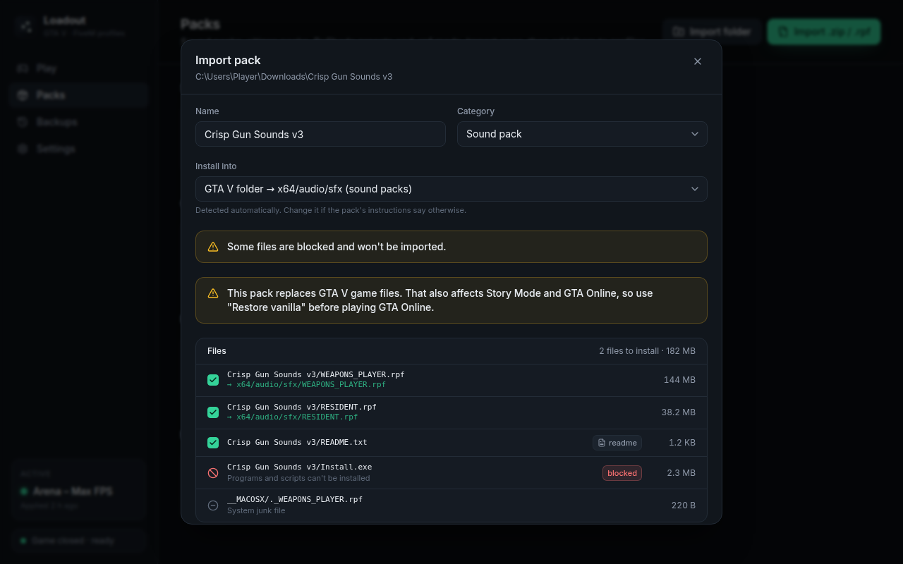

# Loadout

**One-click profile switcher for GTA V and FiveM.** Keep an "Arena – Max FPS" setup with your
gun sound pack and a "City RP – Ultra" setup with ReShade, and switch between them before joining
a server. No more editing `settings.xml` by hand or dragging `.rpf` files around.



## What it does

- **Profiles**: graphics and display settings, GTA's in-game settings (FOV, brightness, HUD,
  volumes…) and a set of packs, all applied together.
- **Quick Play**: save your servers once, each with its profile. ▶ applies the profile and joins
  the server through FiveM's own `fivem://connect/…` link.
- **Pack library**: import a sound pack, citizen pack, ReShade preset or `.rpf` mod from a
  folder, `.zip` or `.rpf`. Loadout works out where its files go and keeps a copy, so each profile
  can switch it on or off.
- **Safe by design**:
  - Every file Loadout replaces is backed up first.
  - Applying is a transaction: if anything fails, or the app crashes halfway, everything is
    put back.
  - **Restore vanilla** removes every pack file and restores the originals.
  - Settings backups are taken before every apply. The first-run backup is kept forever.
- **Notices changes**: if you tweak settings in-game, Loadout offers to save them into the
  profile. If a FiveM update overwrote a pack file, it offers to re-apply.
- **Won't touch a running game**: FiveM reads its settings at start-up and rewrites them on exit,
  so Loadout waits for the game to close, or closes it for you if you ask.

| Edit a profile                                           | Preview before applying                              |
| -------------------------------------------------------- | ---------------------------------------------------- |
|  |  |



## Install

Download the Windows installer (`Loadout_x.y.z_x64-setup.exe`) from the latest
[release](../../releases), or from the `loadout-windows` artifact of a CI run on the **Actions**
tab. It installs per-user, with no admin rights needed.

- Windows will probably show a **SmartScreen** warning because the app isn't code-signed. Click
  _More info → Run anyway_.
- Loadout needs Microsoft Edge WebView2, which Windows 10/11 already have. If it's missing, the
  installer downloads it.
- **GTA V installed under `Program Files`?** Windows only lets administrators change files
  there. Sound packs that replace game audio need _Run as administrator_ in that case.
  Everything else works without it.

## How to use it

1. **First run**: Loadout finds your folders (`FiveM.app`, `%APPDATA%\CitizenFX`, the GTA V folder,
   `Documents\Rockstar Games\GTA V`) and backs up your current settings. Create a profile from
   your current settings, or start from the _Max FPS_ / _Ultra_ presets.
2. **Packs → Import**: pick a downloaded pack. Check where its files will go (for example
   `GTA V folder → x64/audio/sfx`), then import.
3. **Edit a profile**:
   - _Graphics_: tick the settings this profile controls. Anything unticked is left alone.
   - _Packs_: add packs from the library.
   - _In-game settings_: pick values from `fivem.cfg`.
   - _Advanced_: raw `settings.xml` keys.
4. **Play**: add your servers and link each to a profile. Hit ▶ and Loadout applies the profile,
   then FiveM joins the server.

### Where things live

| What                                      | Path                                                    |
| ----------------------------------------- | ------------------------------------------------------- |
| FiveM graphics & display                  | `%APPDATA%\CitizenFX\gta5_settings.xml`                 |
| FiveM in-game settings (`profile_*` etc.) | `%APPDATA%\CitizenFX\fivem.cfg`                         |
| GTA V (Story/Online) graphics             | `Documents\Rockstar Games\GTA V\settings.xml`           |
| Citizen packs, `.rpf` mods, ReShade       | `%LOCALAPPDATA%\FiveM\FiveM.app\{citizen,mods,plugins}` |
| Sound packs that replace game audio       | `<GTA V folder>\x64\audio\sfx`                          |
| Loadout's own data, backups and logs      | `%LOCALAPPDATA%\Loadout`                                |

Loadout only rewrites the values a profile sets, and keeps every other byte of those files as it
was. Hardware-specific values such as your GPU name, adapter index and replay buffers are never
copied into a profile. That means profiles can be shared between PCs, and the game won't reset
its settings.

## Good to know

- **Pure Mode**: servers with `sv_pureLevel` set may refuse modified files. Use a profile
  without packs for those.
- **GTA Online**: packs that replace files in the GTA V folder also affect Story Mode and GTA
  Online. Restore vanilla before playing Online.
- **Script hooks are blocked**: Loadout refuses to import executables, `.asi` loaders,
  ScriptHookV and `dinput8.dll`. It handles settings and cosmetic files only.
- **FiveM for GTA V Enhanced** (early access since July 2026) isn't supported yet. Its file
  locations aren't confirmed, and Pure Mode is always on there anyway. The engine works from
  path detection and a value schema, so adding it later is a small change.
- A few setting values are marked **verify** in the editor (frame scaling and aspect ratio).
  Their numbers come from community references and haven't been checked in-game yet.

Loadout is not affiliated with Rockstar Games, Take-Two Interactive or Cfx.re.

## Testing on a real PC

This checklist covers what automated tests can't reach:

1. First run detects all four folders (or lets you browse to them).
2. Create **Arena** (Max FPS, plus a gun sound pack) and **RP** (Ultra, no packs).
3. Play Arena. In game, check that the graphics changed and the gun sounds are the pack's.
4. Close FiveM and play RP. Check that Ultra is on and the sounds are vanilla again.
5. **Backups → Restore vanilla**. The GTA V `x64\audio\sfx` files should be the originals
   (Steam/Rockstar "verify files" should find nothing to fix).
6. **Quick Play** with a `cfx.re/join/…` code joins the server.
7. For the settings marked _verify_, set each option in-game and compare it with
   `gta5_settings.xml`.

## Development

Tauri 2 app: a Rust backend in two crates and a React + TypeScript frontend.

```
crates/loadout-core/   all file logic (no UI): settings.xml patcher, schema & presets, fivem.cfg,
                       pack import, the apply engine (plan → journal → execute → rollback),
                       backups, path detection. Fully tested against fake game folders.
src-tauri/             the desktop shell: Tauri commands over loadout-core
src/                   React UI. src/bindings is generated from Rust (ts-rs);
                       src/mock is an in-memory backend for running the UI in a browser
```

Prerequisites: Rust (stable), Node 22, pnpm 10. On Linux, also the
[Tauri system packages](https://v2.tauri.app/start/prerequisites/).

```sh
pnpm install
pnpm tauri dev          # run the desktop app
pnpm dev                # UI only, in a browser, against the mock backend
cargo test -p loadout-core   # core tests (also regenerates src/bindings)
pnpm lint && pnpm typecheck && pnpm test
pnpm tauri build        # Windows installer (run on Windows)
pnpm build && pnpm screenshots   # re-render the screenshots (needs Chromium)
```

To try the real app off Windows, point it at a fake folder layout:
`LOADOUT_SYSTEM_ROOT=/path/with/Local,Roaming,Documents LOADOUT_DATA_DIR=/tmp/loadout pnpm tauri dev`.

The mock backend accepts `?setup=1` (first-run wizard), `?running=1` (FiveM running) and
`?drift=1` (in-game changes) in the URL.

CI checks formatting, clippy, lints and all tests. It also runs the core tests on Windows and
builds the installer as a downloadable artifact. Pushing a `v*` tag creates a draft release.
